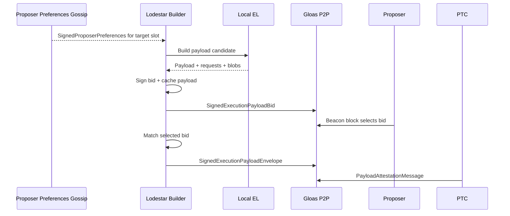
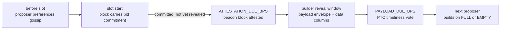
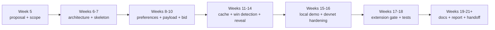

# Lodestar EIP-7732 Builder Proposal

Build an honest-path `lodestar builder` for EIP-7732 / Gloas: a Lodestar-native builder actor that produces local execution payloads, publishes signed p2p bids, detects when one of its bids is selected, and reveals the matching payload envelope.

## Motivation

Ethereum block production already relies heavily on proposer-builder separation, but today's production PBS flow depends on extra-protocol relay infrastructure between validators and builders -- a trusted intermediary sitting in the protocol's most valuable path.

[EIP-7732](https://eips.ethereum.org/EIPS/eip-7732), enshrined proposer-builder separation or ePBS, moves that exchange into the protocol. Instead of including the full `ExecutionPayload` directly in the beacon block, the beacon block carries a signed builder commitment, `SignedExecutionPayloadBid`. The builder later reveals the matching payload through a `SignedExecutionPayloadEnvelope`, and Payload Timeliness Committee members attest whether the payload and blob data were revealed in time.

This project implements the missing Lodestar-side builder for that lifecycle. The [EPF7 project board](https://github.com/eth-protocol-fellows/cohort-seven/blob/master/projects/project-ideas.md#lodestar-eip-7732-builder) describes it as an in-protocol `lodestar builder` under EIP-7732 for Glamsterdam that will submit p2p bids every slot based on locally produced payloads from vanilla execution-layer software such as Nethermind or Ethrex, publish the payload if it wins, and pay the proposer through trustless payment. The purpose of this project is also exploratory. In other words, we aim to find spec gaps that need to be resolved for a consensus client to cleanly act as a builder.

Prior EPF cohorts implemented the consensus side of ePBS in Prysm, Nimbus, and Lighthouse, all centered on the spec and the self-build path. Outside the clients, ethpandaops shipped [buildoor](https://github.com/ethpandaops/buildoor), a standalone builder+relay with an ePBS mode used for devnet lifecycle testing. What Lodestar does not yet have is a consensus-client-native builder actor. That is where this project sits, with buildoor as a reference implementation and interop peer.

Our research into this topic so far suggests Lodestar already has much of the Gloas infrastructure. Types, gossip topics, proposer-preference plumbing, bid validation, bid-pool logic, self-build paths, envelope validation, PTC logic, and builder registry work already exist in Lodestar. The missing piece is the external builder loop itself.

FOCIL / Heze and Deathstar remain scoped context rather than parallel deliverables. FOCIL affects future builder payload construction but is not in the scheduled Glamsterdam set, while the existing Lodestar `deathstar` branch gives us a place to document or later test builder-specific adversarial cases.

## Project description

The project will implement and document an honest-path `lodestar builder` for EIP-7732 / Gloas. The builder observes proposer preferences, produces a local execution payload candidate using a normal execution-layer client, constructs and signs an `ExecutionPayloadBid`, publishes the resulting `SignedExecutionPayloadBid`, caches the exact payload data committed to by the bid, detects whether the bid was selected in a beacon block, and reveals the matching `SignedExecutionPayloadEnvelope`.

Our goal is to add the missing builder-owned loop around infrastructure that already exists or is actively being implemented in Lodestar:

A baseline bid policy is enough for the first version: either a fixed value or a fixed shade below a rough payload-value estimate. If the implementation stabilizes early, a more sophisticated policy becomes stretch work, using payload value, builder balance, pending payments, competing-bid assumptions, and free-option risk.

Deathstar and FOCIL remain gated stretch work, summarized below. A companion [living technical note](https://hackmd.io/@krisos/S1a9mdB7fl) tracks code-path maps, PR state, open implementation questions, bid-policy notes, FOCIL context, and the Deathstar notebook.

**Scope summary**

| Area | Role in this project |
| --- | --- |
| Core project | Implement the missing Lodestar Builder loop for EIP-7732 / Gloas |
| First success target | Local bid -> selection -> reveal demo |
| Strong-success extension | Heze / FOCIL adaptation pass, if FOCIL has merged to `unstable` and Lodestar team discussions make it useful |
| Stretch work | Builder-specific Deathstar scenario, only if Builder is stable |

## Specification

EIP-7732 removes the direct execution payload, blob commitments, and execution requests from the beacon block body; the body instead carries a `signed_execution_payload_bid` and payload attestations, with the full payload revealed later through a signed envelope. The [Gloas honest-builder spec](https://github.com/ethereum/consensus-specs/blob/master/specs/gloas/builder.md) describes the builder as a staked actor that submits bids and later submits payloads; accepted bids commit the builder to pay the proposer whether or not the payload is submitted. The [p2p spec](https://github.com/ethereum/consensus-specs/blob/master/specs/gloas/p2p-interface.md) defines the gossip surface (`execution_payload_bid`, `execution_payload`, `payload_attestation_message`, `proposer_preferences`) and its validation rules.

On the Lodestar side, the current code can already produce a block with a provided builder bid, and the self-build path constructs a bid with `BUILDER_INDEX_SELF_BUILD` (defined as `Infinity` in `packages/params`). The remaining gap is the external builder. The builder is an actor that owns a builder key, observes preferences, builds a payload, signs and publishes a bid, remembers the exact payload package the bid commits to, detects a win, and reveals the envelope.

A compact current-state map:

| Area | Current state | Builder work |
| --- | --- | --- |
| Gloas types and topics | Present / active in Lodestar | Reuse |
| Proposer preferences | Present from validator/proposer side | Consume from builder side |
| Bid validation, bid pool, auctioning | Present / active | Produce valid bids |
| Self-build path | Present (`BUILDER_INDEX_SELF_BUILD`) | Generalize to external builder |
| Bid publication | Endpoint exists | Call from builder |
| Payload construction | Engine API path exists (`engine_getPayloadV6`) | Use as local payload source |
| Bid signing | Confirmed absent -- envelope signer exists as model | Add |
| Bid policy | Not a protocol concern | Baseline, leave room to improve |
| Bid -> payload cache | Builder-owned | Implement |
| Winning-bid detection | Builder-owned; event stream exposes needed topics | Implement |
| Envelope reveal | Validation/publish paths active | Build, sign, publish from builder |
| Devnet builder tooling | buildoor runs the ePBS lifecycle standalone | Interop peer / comparison target |
| Deathstar | Existing branch + chaos catalog | Stretch only after Builder works |
| FOCIL (Heze adaptation) | Existing branch + PR review in progress | Stretch only if merged/settled |

The first design question is where the builder should live. It could comprise a standalone `lodestar builder` command, a beacon-node service, a validator-client-adjacent service, or a temporary internal prototype that later becomes a command.

The builder needs valid proposer preferences before it can submit a trustless bid for a slot. These preferences come from the proposer/validator side and specify values the builder must respect, such as the proposer's `fee_recipient` and `target_gas_limit`. The builder should read them from gossip, an event stream, or Lodestar's internal pool, match them by `proposal_slot` and `dependent_root`, and skip the slot if no matching preferences are available.

Once the preferences are known, the builder can prepare a payload for that slot using Lodestar's existing Engine API / self-build preparation path, including `engine_getPayloadV6`. One open implementation detail is how to pass the proposer's `target_gas_limit` into the local execution client on a per-payload basis, since a static execution-client gas-limit setting cannot follow different proposer preferences slot by slot. The first version can start with the simplest local payload source that exercises the full bid -> reveal loop, then move toward a real execution client such as Ethrex or Nethermind and eventually a Glamsterdam devnet. For comparison and devnet testing, `ethereum-package` can also run buildoor as a dedicated per-participant ePBS builder.

The bid -> payload cache is safety-critical. A builder should only publish a bid if it can later recover the exact payload package committed to by that bid. That cache needs a stable key derived from the bid commitment, and it should fail closed on missing, expired, or mismatched entries rather than revealing a guessed payload.

Winning-bid detection then becomes the bridge between the cache and the reveal path. The builder observes imported or gossiped beacon blocks, inspects the selected `signedExecutionPayloadBid`, and checks whether it matches a locally cached bid. If it does, the builder loads the cached payload package, constructs and signs the matching `SignedExecutionPayloadEnvelope`, publishes it with the required blob / data-column sidecars, and records timing against the payload deadline. The `execution_payload_bid` event stream may also become useful later as a view of competing bids if the bid policy is upgraded. One open implementation question for Lodestar team discussions is whether the builder should reveal on first sight of a valid block, wait until block import, or make that behavior configurable for devnet testing.

## Roadmap

**Week 5 -- Proposal and scope.** Finalize the proposal, living note, base-branch assumptions, and FOCIL/Deathstar scope. *Deliverable: accepted proposal and agreed scope.*

**Weeks 6-7 -- Architecture and builder skeleton.** Map Gloas codepaths, confirm current PR state, choose the service boundary, and build the first configuration/key-handling skeleton. *Deliverable: builder skeleton with separate keystore and remote-signer support that starts and connects.*

**Weeks 8-10 -- Preferences, payload, and bid.** Consume proposer preferences, prepare a local payload candidate through the Engine API / self-build path, and construct, sign, and publish valid bids with a baseline policy. *Deliverable: published valid bid for a locally built payload.*

**Weeks 11-14 -- Cache, win detection, and reveal.** Implement the bid -> payload cache, winning-bid detection, envelope construction/signing/publication, data-column handling, and mismatch tests. *Deliverable: selected bid can reveal the matching payload envelope.*

**Weeks 15-16 -- Local demo and devnet hardening.** Run the full loop locally, compare with buildoor/devnet setup, harden timing/cache/fork-choice edges, and add runbook/metrics. *Deliverable: reproducible end-to-end demo and devnet-readiness note.*

**Weeks 17-18 -- Extension gate and tests.** Choose one focused extension: improved bid strategy, Heze / FOCIL adaptation if settled, one builder-specific Deathstar scenario, or continued hardening. *Deliverable: tested extension or stronger core builder.*

**Weeks 19-21+ -- Documentation, report, and handoff.** Polish PRs and docs, finalize the report and presentation, and hand off merged/open work plus follow-up issues. *Deliverable: final EPF report, demo, presentation, and maintainer handoff.*

## Possible challenges

**Evolving EIP-7732 / Gloas specs.** Gloas is still draft, and builder-adjacent containers, deadlines, signing roots, and API surfaces may move during the cohort. The builder should keep bid construction, signing, cache keys, and reveal logic modular enough to follow those changes.

**Builder service boundary.** The cleanest home for `lodestar builder` is not obvious; the first prototype may need to live near existing beacon-node or validator-client services to reuse code.

**Builder identity, registration, and balance.** Builders onboard through dedicated EIP-8282 deposit/exit request contracts (deposits carry inline-verified proofs of possession; exits are authorized by the builder's execution address), need active status and excess balance covering bids plus pending payments. Registration must be reproducible on a devnet, and deposit-signature verification is a known performance surface ([Lodestar #9436](https://github.com/ChainSafe/lodestar/pull/9436)).

**Payload cache correctness.** The exact bid -> payload mapping must survive to reveal; misses and mismatches fail closed. Recent envelope-cache and idempotency PRs show this path has real resource and correctness edge cases.

**Timing and PTC visibility.** The reveal must beat the payload deadline for the PTC -- and, since [consensus-specs #5210](https://github.com/ethereum/consensus-specs/pull/5210), a late payload is forcibly reorged by the next proposer. Local success may not imply devnet success under real propagation.

**Bid policy.** Fixed-value is enough for the honest path, but a stronger builder eventually needs payload value, competing bids, balance constraints, canonical-inclusion risk, and free-option incentives -- an unbounded research surface kept behind the extension gate.

## Goal of the project

The project is successful if Lodestar has a working, tested, and documented honest-path EIP-7732 builder prototype.

**Minimum success:**

- Architecture note and builder service/command skeleton with configuration and key-handling design.
- Proposer-preference lookup, local payload construction, bid construction/signing/p2p publication, bid -> payload cache, winning-bid detection, and envelope construction/signing/publication.
- Core bid/reveal-path tests and documentation of spec gaps, Lodestar gaps, devnet assumptions, FOCIL base-branch context, and builder-specific Deathstar adversarial cases.

**Strong success:**

- Reproducible local end-to-end demo with a real local execution client.
- Configurable bid policy plus bid/win/reveal/timing logs and metrics.
- One or more PRs merged or in review.
- Heze / FOCIL adaptation pass ([dependency](https://github.com/ChainSafe/lodestar/pull/7342)).
- Server-side of the builder api and serve trustless bids via api (blocked by [client-side builder api](https://github.com/ChainSafe/lodestar/pull/9594) + specs).
- Final write-up of what existed, what was added, and what remains.
- Advanced payload preparation: predict whether the proposer will build on the FULL or EMPTY parent and prepare payloads ahead of time, potentially multiple per slot ([see more](https://github.com/eth-protocol-fellows/cohort-seven/pull/161#discussion_r3574786863)).

**Stretch success:**

- Improved bid policy beyond a fixed constant.
- Builder-adversarial Deathstar matrix with one or two implemented scenarios.
- Deeper write-up of builder bidding constraints under ePBS and follow-up issues for future adversarial builder work.
- Run a kurtosis devnet with lodestar builder and Buildoor, consistently out-bid Buildoor's bids and get selected.
- Research and potentially introduce envelope withholding when early attester signals suggest a weak proposer block (note that there is no unbundling risk in Lodestar and keep in mind that withholding payload on a future canonical block results in a fund loss).

## Collaborators

### Fellows

- [Kris O'Shea](https://github.com/krisoshea-eth)
- [Marko Lazic](https://github.com/markolazic01)

### Mentors

- [Nico Flaig](https://github.com/nflaig) -- Lodestar (ChainSafe); co-author of EIP-7732; listed mentor for both the Builder and Deathstar project ideas.

## Resources

- **[Living technical note](https://hackmd.io/@krisos/S1a9mdB7fl)** -- companion document for the full PR map, code-path map, cache design, bid-policy notes, Deathstar notebook, and resource library
- **[Presentation slides](https://docs.google.com/presentation/d/1cmC3fpu652gZFTIm2_P1lIYOfC2M_w3c5qXSUZ4B6lc)** -- Lodestar EIP-7732 Builder project presentation
- [EIP-7732](https://eips.ethereum.org/EIPS/eip-7732) - Gloas [builder](https://github.com/ethereum/consensus-specs/blob/master/specs/gloas/builder.md) and [p2p](https://github.com/ethereum/consensus-specs/blob/master/specs/gloas/p2p-interface.md) specs - [EIP-7773 (Glamsterdam meta)](https://eips.ethereum.org/EIPS/eip-7773) - [EIP-8282 (builder deposits/exits)](https://eips.ethereum.org/EIPS/eip-8282)
- EPF7 project ideas: [Builder](https://github.com/eth-protocol-fellows/cohort-seven/blob/master/projects/project-ideas.md#lodestar-eip-7732-builder) - [Deathstar](https://github.com/eth-protocol-fellows/cohort-seven/blob/master/projects/project-ideas.md#lodestar-adversarial-node)
- [Lodestar](https://github.com/ChainSafe/lodestar) - the builder gap: [`produceBlockBody.ts`](https://github.com/ChainSafe/lodestar/blob/unstable/packages/beacon-node/src/chain/produceBlock/produceBlockBody.ts) - [Deathstar chaos catalog](https://github.com/ChainSafe/lodestar/blob/deathstar/EPBS_CHAOS_FEATURES.md)
- [buildoor](https://github.com/ethpandaops/buildoor) - [ethereum-package](https://github.com/ethpandaops/ethereum-package) - [glamsterdam-devnet-6](https://dora.glamsterdam-devnet-6.ethpandaops.io/)
- [Why enshrine PBS?](https://ethresear.ch/t/why-enshrine-proposer-builder-separation-a-viable-path-to-epbs/15710) - [PTC: an ePBS design](https://ethresear.ch/t/payload-timeliness-committee-ptc-an-epbs-design/16054) - [The Free Option Problem in ePBS](https://collective.flashbots.net/t/the-free-option-problem-in-epbs/5115) - [Who Wins Ethereum Block Building Auctions and Why?](https://drops.dagstuhl.de/entities/document/10.4230/LIPIcs.AFT.2024.22) - [Block vs. Slot Auction PBS](https://mirror.xyz/julianma.eth/CPYI91s98cp9zKFkanKs_qotYzw09kWvouaAa9GXBrQ) (Julian Ma)
